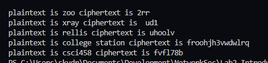

<!-- # Assignment -->

## Question 1: Encode the following plaintext messages (M) using Caesar cipher encryption. 
- M = zoo, E(M) = 2rr
- M = xray, E(M) = ud1
- M = rellis, E(M) = uhoolv
- M = college station, E(M) = froohjh3vwdwlrq
- M = csci458, E(M) = fvfl78b 

### substitution_functions.py output
``` 
plaintext is zoo ciphertext is 2rr
plaintext is xray ciphertext is  ud1
plaintext is rellis ciphertext is uhoolv
plaintext is college station ciphertext is froohjh3vwdwlrq
plaintext is csci458 ciphertext is fvfl78b 
```


<!--  -->


